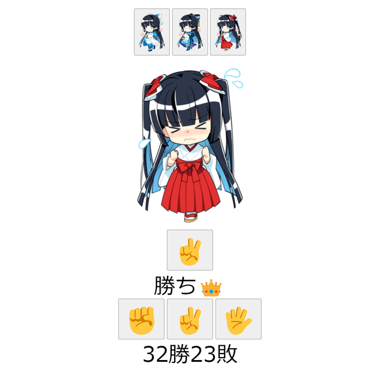

# 課題01 じゃんけん01

 

## ①課題内容（どんな作品か）
- じゃんけんゲーム

## ②工夫した点・こだわった点
- 私の公式応援キャラクター [水晶雫](https://suishoshizuku.com/) さんとじゃんけんを楽しめるようにしました。
- 衣装もオリジナルデザインの和服に加えて、アイドル衣装、巫女衣装に切り替えられるようにしました。

## ③難しかった点・次回トライしたいこと(又は機能)
- 新規ボイスの収録が難しいためボイスはありません。せっかく、キャラクターがいるので専用ボイスも欲しかったですね。
- 環境によって絵文字フォントが適切に表示されないため、font-familyで絵文字フォントを設定する必要がありました。

## ④質問・疑問・感想、シェアしたいこと等なんでも
- 水晶雫さんは、「アキバで見かけた萌えキャラコンテスト」を3連覇しています！
- [「アキバで見かけた萌えキャラコンテスト 2022」結果発表](https://akiba-pc.watch.impress.co.jp/docs/sp/1467382.html)
- [「アキバで見かけた萌えキャラコンテスト 2021」結果発表](https://akiba-pc.watch.impress.co.jp/docs/sp/1376044.html)
- [「アキバで見かけた萌えキャラコンテスト 2020」結果発表](https://akiba-pc.watch.impress.co.jp/docs/sp/1297107.html)
